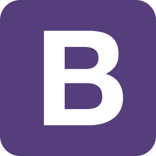

        
        <h1>Hola 👋, soy Yorman Londoño</h1>
        <h3>
           Un apasionado desarrollador web fullstack de Colombia. Un gusto en saludarte y espero con esto me conozcas un poco mas.
        </h3>

---

# Un poco sobre mi:

## ¿Quien soy?

🧒🏾 Desde pequeño siempre supe que me queria dedicar al mundo IT, me emocionaban los desafíos que me motivaran a buscar soluciones de forma creativa, y conforme iba creciendo la ganas de iniciar en este mundo se hacian mas fuertes, por eso estudié Ingenieria de Sistemas y Telecomunicaciones, pero por esas cosas de la vida, mientras terminaba la universisdad comence a trabajar en un Banco en el cual hice carrera en areas administrativas durante más de 14 años, pero mis deseos de continuar aprendiendo eran imparables por lo que mientras trabajaba, hacia cursos y estudiaba, con el fin de buscar una posición en el sector IT con los conocimientos adquiridos, y bueno en el 2022 tome la desición de hacer el bootcamp Hernry para afianzar mis conocimientos y buscar con mayor fuerza lograr mi sueño de ingresar a esta industria... 🙌🏾

## ¿Que hago?

🧑🏾‍💻 Actualmente me dedico a desarrollar proyectos por mi cuenta y a aprender nuevas tecnologias que me ayuden a seguir mejorando, ya que en este mundo IT que va tan rapido, no podemos quedarnos atras.

## ¿A dónde me dirijo?

📈 Mi meta es ayudar a las personas a resolver problemas cotidianos con codigo, ya que lo mas preciado que tiene una persona ademas de la familia, es el tiempo. Por eso mi interes es el de poder hacer la vida de las personas mas facil por medio de del código y asi permitirle a las personas difrutar mas las cosas que aman. (Yo ya estoy disfrutando de lo que amo!!!)💟

## ¿Qué tecnologías uso?

💻 Como dicen por ahi, "Si amas lo que haces, ni los lunes te quitaran la sonrisa" es por eso que desde que no he parado de aprender y mejorar mis conocmientos y habilidades, tanto asi que mientras trabajaba en el Banco me inscribí en un bootcamp de desarrollo web que me permitio encontrar la que considero mi pasion, es por eso que he podido desarrollar conocimientos solidos en las siguientes tecnologias:

### Frontend:

    
    
    
    
    
       

### Backend:

    
    
    

### En progreso:

     

## Si te gusto lo que leíste, no dudes en contactarme.

📠Te dejo por aqui las diferentes formas en las que me puedes contactar. 
📫 yorsh355@gmail.com

 

        
       

